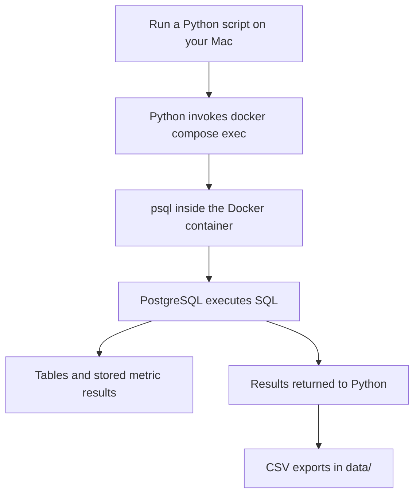

# Architecture overview

Priced In currently separates its backend work into `scripts/` for Python and `db/` for SQL. There is no single `backend/` folder. Python runs on your Mac; PostgreSQL runs inside Docker. The P6 web API lives in `api/` and runs in a second Docker container.

For the complete command sequence, see [local operations](OPERATIONS.md). The user-facing methodology is served at `/methodology`. Public deployment remains P9.

## Where everything lives

```text
priced-in/
├── data/                 Reviewed CSV inputs and exported results
├── api/                  FastAPI service and its Docker image
├── scripts/              Python validation, downloads and SQL orchestration
├── db/                   SQL tables, imports and calculations
├── docker-compose.yml    PostgreSQL container configuration
├── web/                  API-connected HTML and JavaScript
└── docs/                 Methodology, reviews and architecture notes
```

## How Python, SQL and Docker connect



Docker runs the PostgreSQL database service. A SQL file contains instructions for that database, such as creating a table or calculating a return. `psql` is PostgreSQL's command-line client: it sends those instructions to the database and returns the results.

The Python helper in [`scripts/db.py`](../scripts/db.py) runs commands shaped like this:

```sh
docker compose exec -T db psql -X -v ON_ERROR_STOP=1 \
  -U priced_in -d priced_in -f /sql/04_metrics.sql
```

Here, `db` identifies the Docker Compose service, `-U` selects the database user, `-d` selects the database, and `-f` selects a SQL file. `ON_ERROR_STOP` makes the client stop when SQL fails. Python currently invokes this command through a subprocess rather than opening a database connection through a Python driver.

Python is a convenience layer for running the steps in the correct order and stopping on errors. You could run the individual Docker and SQL commands manually. It also handles price downloads, while financial calculations remain in SQL.

## Files versus database storage

Docker Compose exposes two local folders inside the container as read-only mounts:

| Folder on your Mac | Container path | Purpose |
|---|---|---|
| `db/` | `/sql/` | SQL files that `psql` can execute |
| `data/` | `/seed/` | CSV files that imports can read |

The database's actual stored tables live separately in the persistent Docker volume `priced-in_postgres_data`, mounted at `/var/lib/postgresql/data`. Stopping the container preserves that volume. Editing a CSV does not automatically update the database; you must run its importer.

PostgreSQL is exposed locally at `127.0.0.1:5433` by default, mapped to port `5432` inside the container. The database and user are both `priced_in`; the local password is in the ignored `.env` file.

## The current data pipeline

| Step | Python entry point | Database work |
|---|---|---|
| Setup and seed import | `scripts/db.py setup` | Creates tables and imports approved events and estimates using SQL files 01–03 |
| Historical prices | `scripts/prices.py` | Downloads and validates Yahoo prices, then sends SQL to upsert the `prices` table |
| Estimate audit | `scripts/validate_estimates.py` | Reads PostgreSQL and compares its values and eligibility with the CSV inputs |
| Metric calculation | `scripts/metrics.py` | Executes `db/04_metrics.sql`, then exports SQL results to CSV |

For example:

```sh
python3 scripts/metrics.py
```

This command validates estimate consistency, executes the SQL metric pipeline, and exports `data/p5_metrics.csv` and `data/p5_reconciliation.csv`. Python does not calculate the financial metrics itself.

PostgreSQL stores events, estimates and prices in tables. `automatic_eps_inputs` is a view that selects only eligible EPS pairs. The metric SQL uses those inputs and trading-session prices to calculate returns, EPS surprises, excess returns, volume ratios and divergence classifications.

An ordinary view executes its query when read. The `event_metrics` **materialized view** stores calculated rows for later reads. It needs an explicit refresh through the metrics command after input changes; it does not update automatically.

## Frontend and API connection

FastAPI serves the connected HTML/JavaScript interface at `/`. The page fetches events and metrics through the API:


The API queries PostgreSQL through psycopg using a SELECT-only login. It reads the stored results without downloading prices or running the import pipeline whenever someone opens the website. Data collection and metric refresh remain separate maintenance commands.

For the calculation details, see the [P5 SQL walkthrough](P5_REVIEW.md). For setup commands, see the [README](../README.md#local-postgresql-setup).
